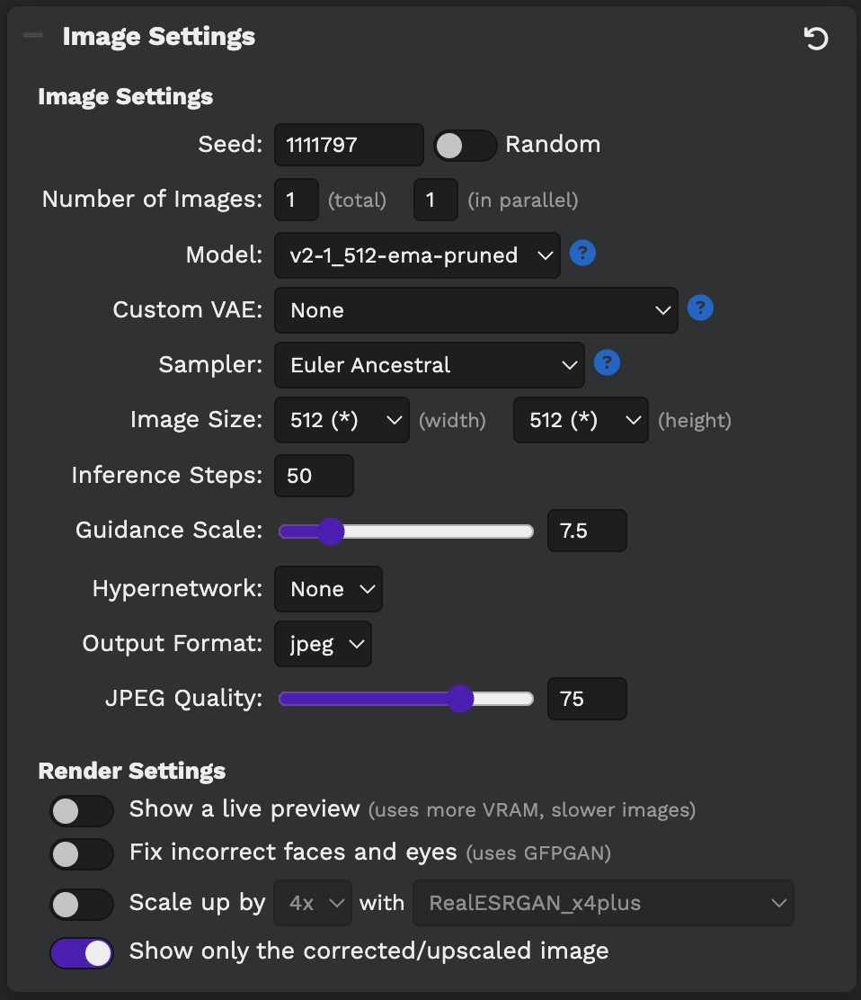

# Stable Diffusion Guide (2023)

Stable Diffusion
- [How AI Image Generators Work (Stable Diffusion / Dall-E) - Computerphile](https://www.youtube.com/watch?v=1CIpzeNxIhU)
- [How does Stable Diffusion work?](https://stable-diffusion-art.com/how-stable-diffusion-work/)
- Stable Diffusion 2 uses Open CLIP, which was trained using 5.85 billion image / text pairs from [LAION-5B](https://laion.ai/blog/laion-5b/)
  - [CLIP Search Demo](https://rom1504.github.io/clip-retrieval/?back=https%3A%2F%2Fknn.laion.ai&index=laion5B-H-14&useMclip=false) search for images in the LAION-5B dataset from text description
- Open AI's [CLIP](https://openai.com/blog/clip/) was designed to describe what is in an image
  - This model can be used to help guide image generation by evaluating generated images 

## Accessing Stable Diffusion

Apple devices (M1/M2/M3)
- [DiffusionBee](https://diffusionbee.com/) - app for laptops
- [Draw Things](https://drawthings.ai/) - app for iOS and laptops
- [Automatic1111](https://github.com/AUTOMATIC1111/stable-diffusion-webui) - untested
- [ComfyUI](https://github.com/comfyanonymous/ComfyUI) - node-based programming environment - great for learning!
  - [ComfyUI SDXL Turbo worklflow](https://comfyanonymous.github.io/ComfyUI_examples/sdturbo/) - realtime/fast image generation
- [Pinokio](https://pinokio.computer/) - ComfyUI works with some tweaking (need to manually go into app directory and git clone comfyui)

PC laptops with nVidia graphics cards
- [Automatic1111](https://github.com/AUTOMATIC1111/stable-diffusion-webui)
- [ComfyUI](https://github.com/comfyanonymous/ComfyUI)

Online services
- [Hugging Face stabilityai/stable-diffusion](https://huggingface.co/spaces/stabilityai/stable-diffusion)

The lab computers have [Stable Diffusion](https://github.com/Stability-AI/stablediffusion) installed with the [Easy Diffusion](https://github.com/cmdr2/stable-diffusion-ui) web UI. The web UI is accessible while on campus or using the VPN.

[Stable Diffusion web UI links (Brightspace, class students only)](https://brightspace.nyu.edu/d2l/le/lessons/265669/units/8229531)

Available models:
- [Stable Diffusion 2](https://github.com/Stability-AI/stablediffusion)
  - [Stable Diffusion 2.1 base](https://huggingface.co/stabilityai/stable-diffusion-2-1-base)
    - Designed for 512x512 output
    - Recommended for exploring prompts
    - 5GB model checkpoint
  - [Stable Diffusion 2.1](https://huggingface.co/stabilityai/stable-diffusion-2-1)
    - Designed for 768x768 output
    - Slower than base since higher resolution
    - Recommended for higher resolution output after exploring prompts
    - 5GB model checkpoint
- Stable Diffusion 1.4
  - Previous version with different training
  - [Stable Diffusion 1 vs 2 - What you need to know](https://www.assemblyai.com/blog/stable-diffusion-1-vs-2-what-you-need-to-know/)

Note: when exploring text to image models some links (e.g. to custom trained models) eventually lead to NSFW content.

## Easy Diffusion (Stable Diffusion Web UI)

- [How to use](https://github.com/cmdr2/stable-diffusion-ui/wiki/How-to-Use)
- [UI Overview](https://github.com/cmdr2/stable-diffusion-ui/wiki/UI-Overview)
- [Writing prompts](https://github.com/cmdr2/stable-diffusion-ui/wiki/Writing-prompts)

### Recommended settings
- Set Model (start with v2-1_512-ema-pruned)
- Set the Image Size (512x512 for 512 model, or 768x768 for 768 model)

Recommended initial settings:




These settings offer a good balance of speed and quality while exploring while using our shared machines. Once you have a prompt or image that you like you can experiment with other settings to increase the quality of the final output.

### Writing the prompt
- Write your prompt and negative prompt
- With the Euler Ancestral sampler (recommended for initial ideation) running more inference steps ("Draw another 25 steps") may significantly change the image. Other samplers generally increase the quality rather than changing the image 

### Saving the prompt
- Hover over the generated image and select "Copy settings (TXT)"
  - (Enabled by the [Copy Settings plugin](https://github.com/cmdr2/stable-diffusion-ui/wiki/UI-Plugins#information-plugins))

### Downloading your image
- Hover over image and click Download

### Crediting your images
"Created with Stable Diffusion 2.1 using prompt {prompt}" and include prompt data with code formatting. Include any input image. There should be enough information to recreate the image you generated (similar to including your source code).

Hover over the generated image and select "Copy settings (TXT)" to get the full prompt data copied to your clipboard.

e.g.


Created with Stable Diffusion 2.1 using prompt "New York University Abu Dhabi is a private liberal arts college located in Abu Dhabi United Arab Emirates"

Prompt data:
```
prompt: New York University Abu Dhabi is a private liberal arts college located in Abu Dhabi United Arab Emirates
seed: 1111797
negative_prompt: 
num_outputs: 1
num_inference_steps: 50
guidance_scale: 7.5
width: 512
height: 512
vram_usage_level: balanced
use_stable_diffusion_model: v2-1_512-ema-pruned
use_vae_model: 
stream_progress_updates: true
stream_image_progress: false
show_only_filtered_image: true
output_format: jpeg
output_quality: 75
metadata_output_format: txt
original_prompt: New York University Abu Dhabi is a private liberal arts college located in Abu Dhabi United Arab Emirates
active_tags: 
inactive_tags: 
sampler_name: euler_a
```


### Increasing output quality
- Adjust your prompt
- Change the guidance scale
- Use the 768x768 model
- Change samplers and run more inference steps
  - The recommended / default Euler Ancestral is fast but will change the image rather than increasing the quality
  - Use your generated image as input, change to a different sampler, and run more inference steps
  - See [Stable Diffusion Samplers](https://nightcafe.studio/blogs/info/stable-diffusion-samplers) for sampler suggestions
  - [Easy Diffusion samplers](https://github.com/cmdr2/stable-diffusion-ui/wiki/How-to-Use#samplers)
  - Hover over image and "Draw another 25 steps"
- Fix faces (runs another model over the generated image to fix faces)
- Upscale your image (runs another model to upscale)
- Use inpainting to selectively regenerate parts of your image
- Use img2img to regenerate your image using the current image as input

## Writing prompts
- [Stable Diffusion Prompt Book](https://openart.ai/promptbook)

- Consider both the prompt and the negative prompt
- Add emphasis (weighting) to different parts of the prompt to increase their importance
- What prompts produce good / poor output? What prompts are blocked?

## Inpainting / Image to Image

Techniques
- Start with an input image that you create (e.g. a simple drawing) and use that to condition the generated image.
- Take a generated output image and use that as the input image to continue refining / tweaking it
- Mask part of the input image to have Stable Diffusion just paint those areas. E.g. draw a simple skyline into one of your photos then mask that area to have Stable Diffusion replace your drawing with generated imagery

## Outpainting (and repainting)

Outpainting is a technique to extend an existing image to a larger canvas. The existing image is extended outwards. You can also erase parts of the existing image and repaint them.

- [stablediffusion infinity](https://huggingface.co/spaces/lnyan/stablediffusion-infinity) - Outpainting with Stable Diffusion on an infinite canvas
  - Watch the video for instructions on the (rather confusing) UI
- [stablediffusion-infinity (Hugging Space)](https://huggingface.co/spaces/lnyan/stablediffusion-infinity) - live demo on Hugging Space

https://user-images.githubusercontent.com/1665437/197244111-51884b3b-dffe-4dcf-a82a-fa5117c79934.mp4

## Automatic1111

[How to use Stable Diffusion. Automatic1111 Tutorial (YouTube)](https://www.youtube.com/watch?v=nJlHJZo66UA)
- Explains different samplers, how to upscale images, basic inpainting, saving seed, getting settings back from png


## Training Stable Diffusion / Creating custom models
- Textual Inversion
  - Create a small model trained on custom images that is added when using a specific text keyword (e.g. train a small model on images of your dog and add 'mysuperdog' to apply your custom model as guidance)
  - [Create Textual Inversion from !10 images in Automatic1111 (YouTube)](https://www.youtube.com/watch?v=2ityl_dNRNw)
  - [An Image is Worth One Word: Personalizing Text-to-Image Generation using Textual Inversion](https://textual-inversion.github.io/) - official site with example images from paper
  - [Textual Inversion: A method to finetune Stable Diffusion Model (Medium)](https://medium.com/@onkarmishra/how-textual-inversion-works-and-its-applications-5e3fda4aa0bc)
    - In depth analysis of how it works
